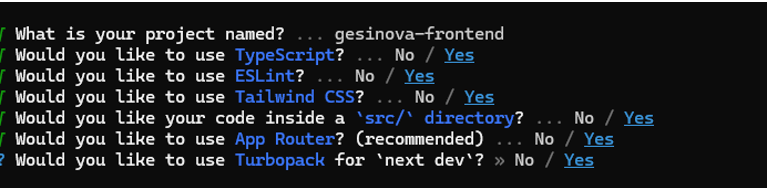

**Next.js**

-	Optimización automática  de imágenes 
-	Renderizado hibrido (SSR), (SSG), (CSR)
-	Renderizado de paginas en el servidor
-	Definición de rutas de API
-	Soporte para TypeScript 
-	Lazy loading

**Developer tools y dependences**

ESLint, es una herramienta de análisis estático que ayuda a mantener un código limpio y consistente en el proyecto. Te da ventajas como:
-	Detección de errores tempranos
-	Código mas limpio  y legible
-	Mejor trabajo en equipo
-	Integración con prettier

```npm install --save-dev prettier eslint-config-prettier eslint-plugin-prettier```

Agregar estas configuraciones en .eslintrc.json para evitar conflictos:

```{ "extends": ["next/core-web-vitals", "prettier"], "plugins": ["prettier"], "rules": { "prettier/prettier": "error" } }```

**Typescript**, es un lenguaje de programación de código abierto, desarrollado por Microsoft, que extiende JavaScript añadiéndole tipado estático y 
otras características para facilitar el desarrollo de aplicaciones complejas y escalable

Tailwindcss, es un framework de CSS de código abierto que permite crear diseños para sitios web



**Turbopack**, es una herramienta de empaquetamiento de módulos que se encarga de combinar los archivos de una aplicación en un solo paquete. Lo que acelera la compilación 
y el desarrollo de aplicaciones. Se centra en la carga diferida y la arquitectura incremental. Reduce el tiempo de compilación y mejora el tiempo de arranque en servidor.