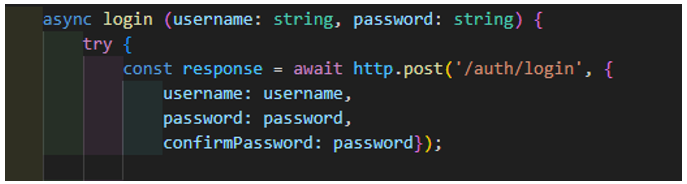
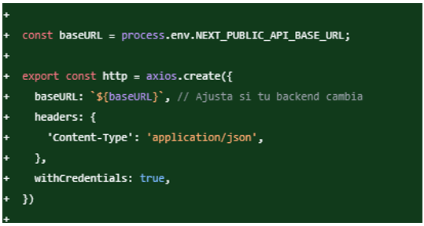
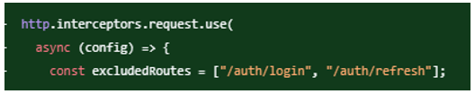
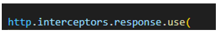
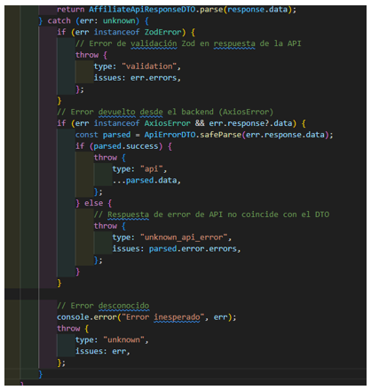
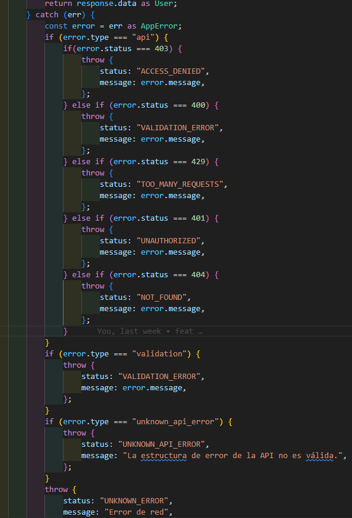

**@/core/infrastructure/api/services/**

***authService.ts***
Logica pura (servicios)

Este archivo suele contener funciones independientes para interactuar con el api:

Responsabilidad: manejar la lógica para conectarse al backend (peticiones HTTP).

El archivo es posible usarlo en cualquier parte; no maneja estados ya que solo contiene las peticiones a la API.

Para poder armar las peticiones y el archivo que contiene la url base de la api, se encuentra en:
https.ts: Base URL e inteceptor

El archivo contiene la lógica en la que se interceptan las respuestas de la API, hace manejo de errores para controlar la respuesta y valida que el refreshtoken aun este funcional

Esta variable baseURL esta consumiendo de una variable en el archivo .env, la cual es configurable, como en el comentario lo indica se ajusta de acuerdo a la URL de conexión al backend.

***Interceptor de peticiones***

Dentro del archivo ponemos encontrar el interceptor que se ejecuta antes de que se envíe cualquier petición HTTP usando el cliente http (Axios). Esta inicial mente excluye la intercepción la petición va para alguna de estas rutas

Actualmente se esta usando el interceptor para validar si existe un accestoken y si es así, agregarlo en el encabezado, si alguna de estas peticiones falla el interceptor lo envía al inicio de la aplicación.

Para la intercepción de las respuestas de las peticiones se tiene el siguiente interceptor. Dentro de este estamos validando la respuesta que no esta devolviendo la api, de esta manera tomar decisiones como sacar al usuario al front si la sesión a expirado.

***Manejo de errores***

El manejo de errores cuenta con la siguiente estructura, para la recepción de todas las peticiones hacia la api

Teniendo encuenta el manejo que se le da a los errores en el services, se recepciona la respuesta de la siguiente manera en el uses case

