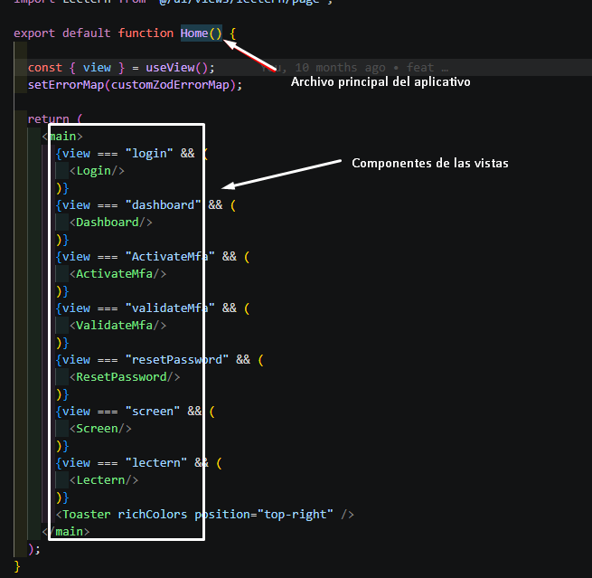
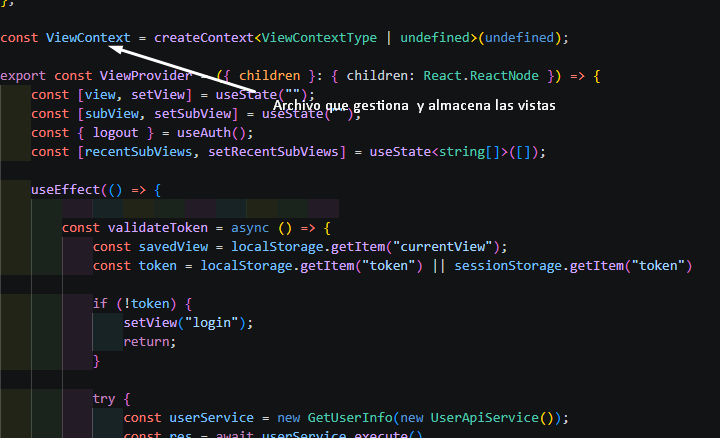
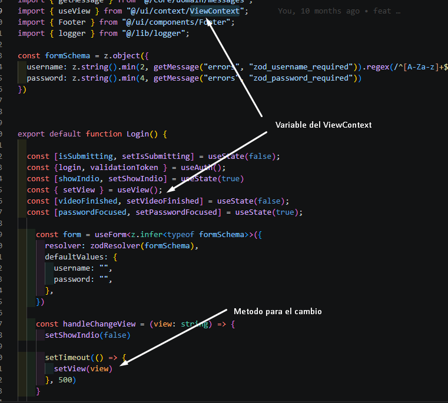
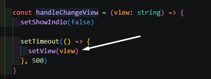
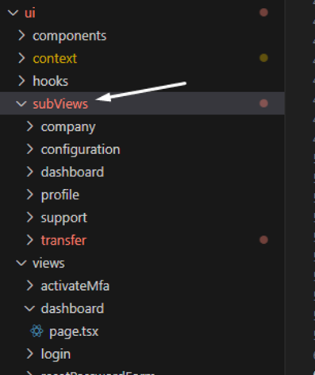
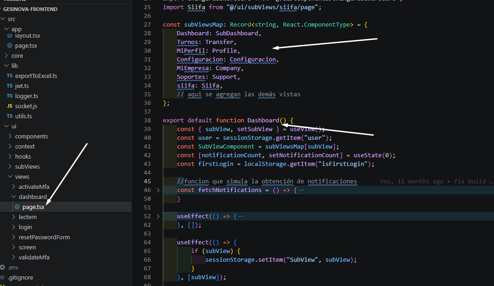

**Pseudo SPA**

Para poder lograr que la aplicación se comporte como una SPA, donde la url siempre sea la misma, pero internamente se renderice diferentes 
vistas según el estado o rutas internas, puedes lograrlo con el estado global y renderizado condicional en lugar de cambiar la URL usando las 
vistas con Estado Global (useState o Context API), aquí podemos ver algunas ventajas:
-	La URL nunca cambia
-	La aplicación se mantiene como una SPA
-	No se necesita next/navigation

Se implementa el archivo ViewContext.tsx  para que el cambio de vista sea posible en cualquier vista del proyecto, por medio del hook

***Sistema de cambio de vistas***

Para el cambio de vistas se debe tener en cuenta que cada archivo principal de las vistas, debe tener el ViewContext para hacer el cambio de la vista
desde esa variable, de la siguiente manera: 

Para usar la función para el cambio de vista en cada componente principal, lo harían de la siguiente manera:

***Sistema de subvistas***

Para los aplicativos en específicos se han creado las subvistas, con la finalidad de crear y separar las vistas de acuerdo al aplicativo en el que se esta trabajando.

El manejo de las subvistas se maneja por medio del dashboard principal utilizando un hook para subView y agregando las vistas en el arreglo subViewsMap

