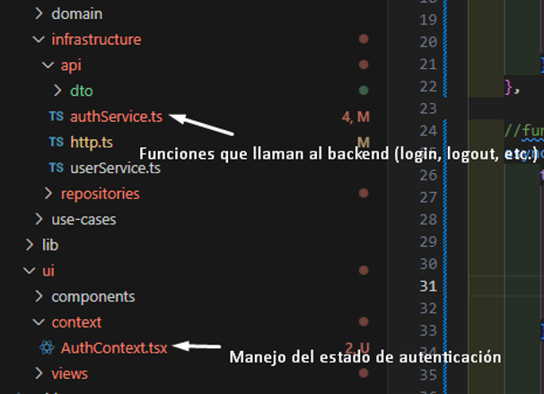
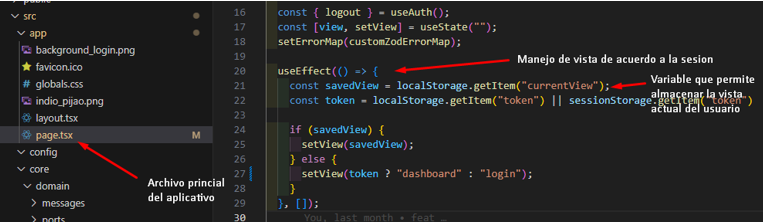
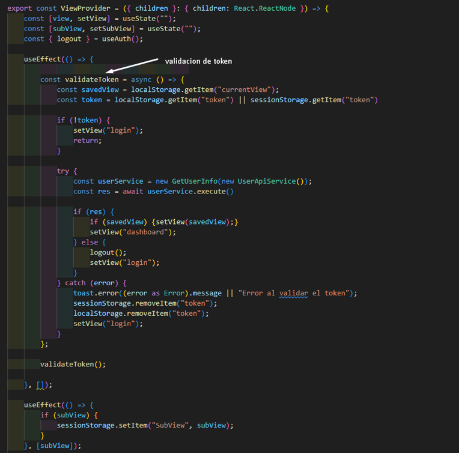

***AuthContext.tsx***
Gestor de estado y sesión

Este archivo envuelve tu app, mantiene el token en memoria y localStorage, dependiendo de como el usuario se logue y si marque la opción de “recordarme”. Al igual que los tokens y la información del usuario.
Responsabilidad: manejar el estado global del usuario autenticado y exponer funciones como login, logout, etc.

En conjunto con el archivo anterior el manejo de sesión, en este caso como no se maneja por medio de rutas el aplicativo, el manejo se realiza por medio de vistas. 
De esta manera el archivo principal debe validar si la sesión del usuario se encuentra activa para así mismo mostrar la vista o enviar al usuario al inicio de sesión. 

Se implementa el archivo ViewContext.tsx  ya que cuenta con la validacion sobre el token, ya que se valida si el token que se esta almacenando 
es valido haciendo peticion al backend con el endpoint para traer la informacion del usuario logueado.

