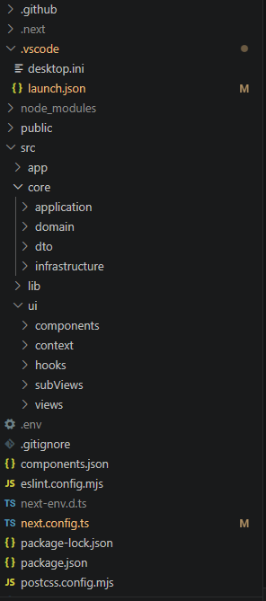
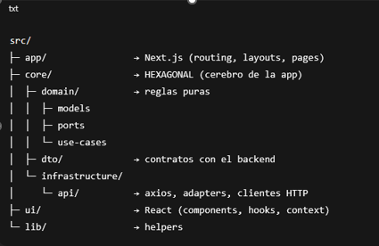
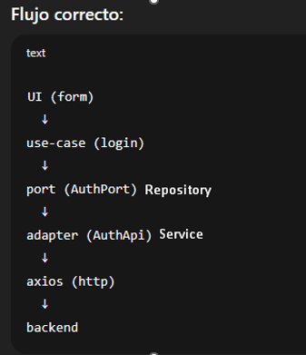
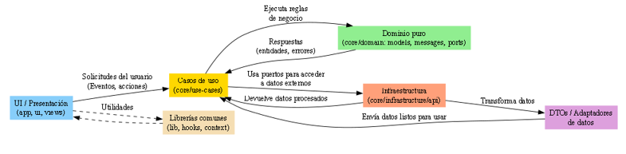

***Src***
Carpeta raíz del código fuente. Contiene toda la aplicación separada en capas siguiendo la arquitectura hexagonal.

***App***
Esta es la carpeta específica de Next.js donde se definen las rutas, páginas y recursos globales.
-	background_login.png, indio_pijao.png → Imágenes usadas en la interfaz.
-	embla.css, globals.css → Hojas de estilo globales o específicas.
-	favicon.ico → Icono de la aplicación.
-	layout.tsx → Componente de layout base que envuelve las páginas (header, footer, etc.).
-	page.tsx → Página principal de la aplicación (generalmente /).

En la arquitectura hexagonal, esta carpeta sería la capa de entrada (interface adapters) para el usuario.

***Core***
Aquí vive toda la lógica de negocio de tu aplicación. Es el corazón de la arquitectura hexagonal.

**Dentro de core**
- Domain: Define el modelo de negocio puro, sin depender de frameworks ni librerías externas.
- messages → Puede contener mensajes de dominio (constantes, enums, errores del negocio).
- models → Entidades y objetos de valor del dominio.
- ports → Interfaces que definen contratos de entrada/salida (ej. repositorios, servicios externos).
- ouse-cases → Casos de uso de la aplicación, donde se orquesta la lógica con las entidades y puertos.

**Dto**: (Data Transfer Objects) Objetos que definen cómo se envían/reciben datos entre capas (por ejemplo, entre frontend y backend).

**infrastructure/api**: Implementaciones concretas para interactuar con APIs externas o tu backend.
Aquí se cumplen los contratos definidos en ports

***Lib***
Librerías o utilidades compartidas que no dependen directamente del dominio (helpers, funciones comunes, etc.).

***Ui***
La capa de presentación de la aplicación.

-	components → Componentes reutilizables de UI (botones, modales, formularios, etc.).
-	context → Contextos de React (ej. manejo de autenticación, configuración global). Context coordina la experiencia de usuario y mantiene estado global,
pero NO contiene lógica de negocio ni conoce la infraestructura.

-	hooks → Hooks personalizados (useAuth, useFetch, etc.).
-	subViews → Vistas parciales o secciones que componen páginas (módulos específicos).

***Views***
Vistas completas que se presentan al usuario (pantallas principales).

