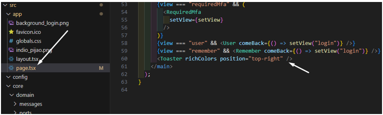
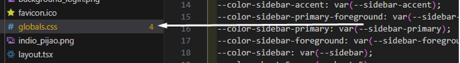
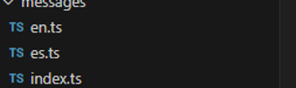
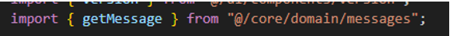
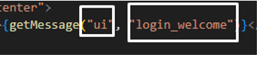

El aplicativo para sus componentes en la vista usa una biblioteca de componente de interfaz de usuario (UI) que ayuda a los desarrolladores a crear aplicaciones web modernas. 
Esta se basa en tailwind CSS y Radix UI.

***Shadcn/ui***

En la interfaz de usuario se emplea el uso de una librería de componentes llamada shadcn/ui, emplea tailwind CSS para los estilos. Esta ha sido escogida ya que es cuenta con componentes reutilizables y permite una personalización mas alta de los componentes, es una librería ligera y flexible. Adicional es compatible con SSR
Su instalación se realizó de la siguiente manera:

```npx shadcn@latest init```

y la instalacion de cada componente se debe realizar con el comando especificado en la pagina oficial:

https://ui.shadcn.com/docs/installation/next

***Zod***

Zod es una libreia de validación y tipado de datos para typescript y javascritp, se usa principalmente para validar datos de los formularios en el frontend, asegurar que las respuestas de la API tengan el formato correcto, crear esquemas de datos tipados de manera correcta.

Se realizó la instalación de la librería de la siguiente manera:

```npm install zod```

y la validación de sus funciones se pueden realizar por medio de la pagina oficial:

https://zod.dev/?id=installation

***sonner***

Es una librería para react, que nos permite modificar el estilo grafico de los toast con los que se presentan las notificaciones, se realiza instalacion por medio del comando:

```npm install sonner```

pagina oficial: https://sonner.emilkowal.ski/

Se configura componente en el archivo principal del aplicativo con la finalidad de que los toast sean accesibles desde cualquier parte del aplicativo.



***Icons***

El aplicativo maneja una librería para los iconos react-icons, permite utilizar diferentes iconos de acuerdo a los que indica la página principal.

Se realiza la instalación con el siguiente comando: 

```npm install react-icons --save```

https://react-icons.github.io/react-icons/

***Paleta de colores e idiomas***

La estructura del proyecto cuenta con un archivo en el que se realiza configuración de variables de css para los colores primarios y secundarios del aplicativo, tanto en modo claro, como en modo oscuro.



Para la configuración de idiomas, se crearon una seria de archivos con los cuales va a exportar variables que le permite consumir variables desde diferentes partes del código para texto en el fronted.



Para usar el mapa de mensajes en otros componentes de la vista, se debe realizar de la siguiente manera:





Para la definición de los colores, clases y componentes usados en el front, se han implementado un table en figma donde detalla la definición de estos componentes:

https://www.figma.com/design/oe5wu4h8bfKX25I53x57vW/Gesinova?m=auto&t=gIWR9sBnguW6CVkY-1